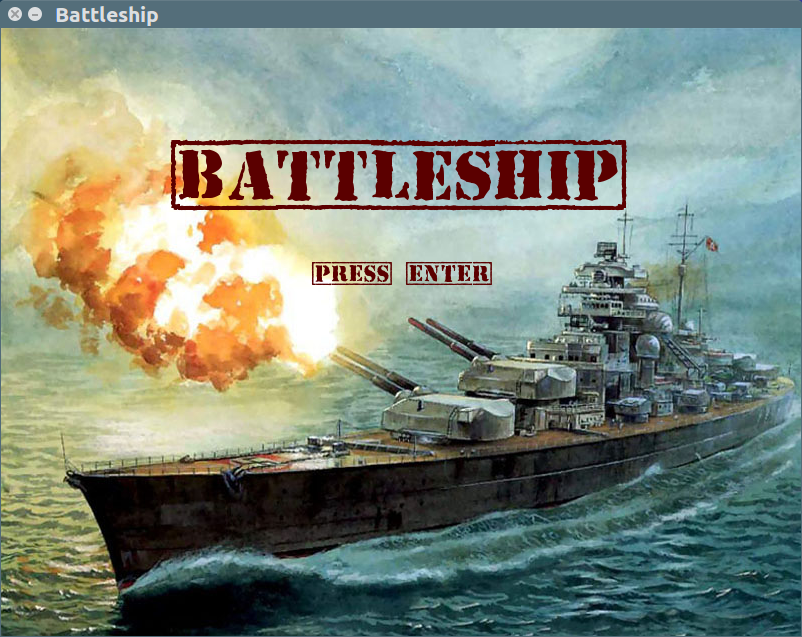
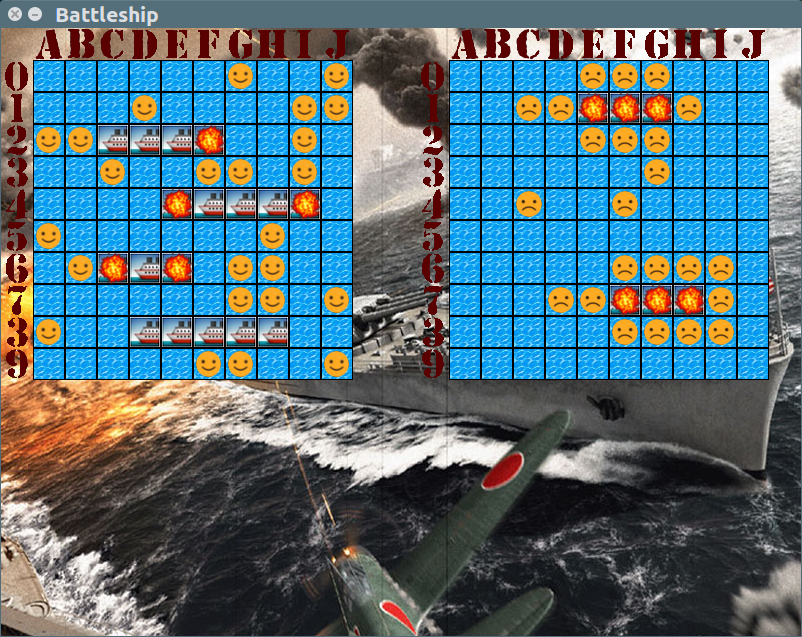

# CS372Proj1
*Readme*

Created by:

Bryan Burkhardt (bmburkhardt@alaska.edu)  
Alexander Eckert (aeckert@alaska.edu)

Project 1 for CS372 Spring 2017 at UAF
Professor Dr. Hartman

[Google Drive folder](https://drive.google.com/drive/folders/0Bzn0zpuV-Sr5YzBLLW1vLTdGYVk?usp=sharing) containing deliverables of the project (User Stories, Diary Entries, GUI design, etc.)

======================================================================

Required packages/software:  
 * C++11 compiler
 * SFML 2.x.x
 * CMake 2.6 or newer
 * GNU Make 4.x
 
======================================================================

Building this project in the Terminal (\*nix):  
* Clone the project from [GitHub](https://github.com/bmburkhardt/CS372Proj1.git)
  * `git clone https://github.com/bmburkhardt/CS372Proj1.git`
* Enter the cloned git repository and create a build folder and enter it:
  * `cd CS372Proj1`
  * `mkdir build`
  * `cd build/`
* Let CMake generate the Makefile for you:
  * `cmake ..`
* If all the required packages are correctly installed and could be found, we can run our Makefile to create the executable:
  * `make`
* Now, you can play the game with the following command:
  * `./battleship`
* Enjoy!!

***

## Impressions

